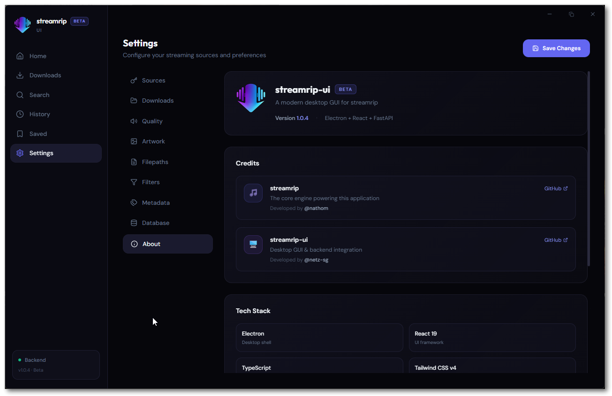

[](https://buymeacoffee.com/sgnetz)

<p align="center">
  
</p>

<h1 align="center">streamrip-ui</h1>

<p align="center">
  <strong>A modern desktop GUI for <a href="https://github.com/nathom/streamrip">streamrip</a></strong><br />
  A polished interface for managing your media library — no terminal required.
</p>

<p align="center">
  <a href="https://github.com/netz-sg/streamrip-ui/releases/latest"></a>
  <a href="https://github.com/netz-sg/streamrip-ui/actions"></a>
  <a href="LICENSE"></a>
  <a href="https://github.com/nathom/streamrip"></a>
</p>

---

## What is this?

**streamrip-ui** is an Electron-based desktop application that wraps [nathom's streamrip](https://github.com/nathom/streamrip) library in a polished, dark-themed interface. It provides a visual experience designed for daily use, replacing the CLI workflow entirely.

> **Note:** This project does not bundle or redistribute streamrip. It depends on a local checkout of the [streamrip](https://github.com/nathom/streamrip) repository as its backend engine.

## Features

- **Paste & Go** — Drop a URL and get a full preview in one click
- **Real-Time Progress** — Per-item progress bars with speed and ETA via a custom progress hook
- **Rich Previews** — Album, track, artist, and playlist views with cover art, tracklists, and quality badges
- **Multi-Source Search** — Search across supported platforms with instant results
- **Queue Management** — Concurrent processing with queue, history, and wishlist
- **Full Configuration** — Every streamrip setting exposed: quality, filepaths, filters, metadata, conversion, database
- **Keyboard Shortcuts** — `Ctrl+1—6` navigation, `Ctrl+F` search focus, `Escape` to dismiss
- **Drag & Drop** — Drop URLs directly onto the window to start previewing
- **Backend Health Monitoring** — Live status indicator with auto-reconnect
- **Toast Notifications** — Status updates for every action — always in the loop

## Tech Stack

| Layer | Technology |
|-------|-----------|
| **Shell** | Electron (frameless, custom titlebar) |
| **Frontend** | React 19 · TypeScript · Tailwind CSS v4 · Zustand · Framer Motion |
| **Backend** | Python · FastAPI · WebSocket · SQLite |
| **Engine** | [streamrip](https://github.com/nathom/streamrip) by [@nathom](https://github.com/nathom) |

## Screenshots

<p align="center">
  
  <br /><em>Paste a URL to instantly preview content with full metadata</em>
</p>

<p align="center">
  
  <br /><em>Search across multiple platforms with instant results</em>
</p>

<p align="center">
  
  <br /><em>Real-time progress tracking with speed and ETA</em>
</p>

<p align="center">
  
  <br /><em>Complete history of all processed items</em>
</p>

<p align="center">
  
  <br /><em>Save items to your wishlist for later</em>
</p>

<p align="center">
  
  <br /><em>Full configuration — sources, quality, filepaths, and more</em>
</p>

## Installation

### Download Installer

Go to [**Releases**](https://github.com/netz-sg/streamrip-ui/releases/latest) and download:

| Platform | File |
|----------|------|
| Windows | `streamrip-ui-Setup-x.x.x.exe` |
| macOS | `streamrip-ui-x.x.x.dmg` |

### Prerequisites

- **Python 3.10+** installed and on your `PATH`
- **streamrip** dependencies: the app will install them automatically on first launch, or you can install manually:

```bash
cd repo
pip install poetry
poetry install
```

### Build from Source

```bash
# Clone the repo
git clone https://github.com/netz-sg/streamrip-ui.git
cd streamrip-ui

# Install frontend dependencies
cd desktop/frontend
npm install

# Install Electron dependencies
cd ..
npm install

# Run in development mode
npm start

# Build installer
npm run dist          # Current platform
npm run dist:win      # Windows .exe
npm run dist:mac      # macOS .dmg
```

## Usage

1. **Launch** the app — the Python backend starts automatically
2. **Paste** a URL into the input bar on the Home page
3. **Preview** the content with full metadata
4. **Process** with one click — monitor progress in the queue
5. **Configure** quality, output paths, filters, and more in Settings

### Keyboard Shortcuts

| Shortcut | Action |
|----------|--------|
| `Ctrl+1` | Home |
| `Ctrl+2` | Downloads |
| `Ctrl+3` | Search |
| `Ctrl+4` | History |
| `Ctrl+5` | Wishlist |
| `Ctrl+6` | Settings |
| `Ctrl+F` | Focus search / URL input |
| `Escape` | Dismiss / blur |

## Project Structure

```
streamrip-ui/
├── desktop/
│   ├── electron/              # Electron main process
│   │   ├── main.js                # Window creation, backend spawn
│   │   └── preload.js             # Context bridge
│   ├── frontend/              # React + TypeScript + Tailwind
│   │   ├── public/                # Static assets & logo
│   │   └── src/
│   │       ├── api/               # HTTP & WebSocket clients
│   │       ├── components/
│   │       │   ├── layout/        # AppShell, Sidebar, TitleBar
│   │       │   └── previews/      # Album, Track, Artist, Playlist views
│   │       ├── hooks/             # useKeyboardShortcuts, etc.
│   │       ├── pages/             # Home, Downloads, Search, Settings, History, Wishlist
│   │       ├── stores/            # Zustand state management
│   │       └── styles/            # Global CSS
│   ├── backend/               # Python FastAPI server
│   │   ├── main.py                # App entry, health endpoint
│   │   ├── api/
│   │   │   ├── endpoints/         # REST routes (config, download, search, url, wishlist)
│   │   │   ├── schemas/           # Pydantic request/response models
│   │   │   └── websocket.py       # WebSocket for real-time progress
│   │   └── core/
│   │       ├── compat_check.py    # Startup compatibility validation
│   │       ├── download_manager.py
│   │       ├── progress_hook.py   # Real-time progress tracking
│   │       ├── streamrip_wrapper.py  # Hardened adapter layer
│   │       └── wishlist.py
│   └── tests/                 # Compatibility tests
├── repo/                      # streamrip library (git submodule)
└── .github/workflows/         # CI: compat checks, release builds
```

## Credits

- **[streamrip](https://github.com/nathom/streamrip)** by [@nathom](https://github.com/nathom) — the core engine that powers this application
- Built with [Electron](https://www.electronjs.org/), [React](https://react.dev/), [FastAPI](https://fastapi.tiangolo.com/), and [Tailwind CSS](https://tailwindcss.com/)

## License

This project is licensed under the [GNU General Public License v3.0](LICENSE) — the same license as streamrip.

## Disclaimer

This application is provided for personal use only. The developers are not responsible for any misuse of this software.